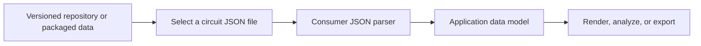

# Global Motorsport Circuits JSON

A dependency-free, version-controlled collection of motorsport circuit paths and metadata, distributed as plain JSON for use in mapping, visualization, and analysis tools.

[](https://www.json.org/)
[](LICENSE)

> [!IMPORTANT]
> This repository is a **data-only catalog**, not an executable logging library, SDK, or hosted API. It contains circuit metadata and sampled `x`/`y` paths; it does not include race telemetry, timing, or an explicit coordinate reference system or measurement unit.

## Table of Contents

- [Features](#features)
- [Tech Stack & Architecture](#tech-stack-architecture)
  - [Project Structure](#project-structure)
  - [Data Flow and Design Decisions](#data-flow-and-design-decisions)
- [Getting Started](#getting-started)
  - [Prerequisites](#prerequisites)
  - [Installation](#installation)
- [Testing](#testing)
- [Deployment](#deployment)
- [Usage](#usage)
- [Configuration](#configuration)
- [License](#license)
- [Contacts & Community Support](#support-the-project)

## Features

- **142 individual circuit records** in the current repository snapshot, each stored as a standalone JSON file.
- **Multiple motorsport collections:** Formula 1, IndyCar, MotoGP, WEC, and a catch-all `other` directory.
- **Active and historic classifications:** Formula 1 is divided into `active` and `historic` subdirectories; every record also contains a `status` field.
- **Consistent record shape:** circuit name, discipline tags, status, and an ordered list of two-dimensional points.
- **Cross-series tagging:** the `disciplines` array can contain more than one tag, so a record can be discovered through its metadata as well as its directory.
- **Language- and platform-neutral:** JSON can be read by any runtime with a JSON parser; no package installation, database, service, or network connection is needed after checkout.
- **Suitable for downstream tooling:** load one circuit at a time or scan the collection to build a catalogue for a map, visualization, simulator, or analysis workflow.
- **Git-native collaboration:** contributions, reviews, and data changes use the repository's normal GitHub workflow. See [`CONTRIBUTING.md`](CONTRIBUTING.md), [`CODE_OF_CONDUCT.md`](CODE_OF_CONDUCT.md), and [`SECURITY.md`](SECURITY.md) for project policies.

The directory counts below describe the current checkout and will change as the dataset grows:

| Directory | Records |
| --- | ---: |
| `f1/active/` | 23 |
| `f1/historic/` | 35 |
| `indycar/` | 47 |
| `motogp/` | 14 |
| `other/` | 11 |
| `wec/` | 12 |
| **Total** | **142** |

> [!NOTE]
> Directory names are organizational groupings, not a complete taxonomy. Use each record's `disciplines` array when filtering by series; some circuits have multiple discipline tags.

<details>
<summary>Observed discipline tags and status counts in this snapshot</summary>

Discipline counts are **tag occurrences**, not unique files. They add up to more than the record count because a record may have multiple tags. Treat the tag set as open-ended; it can change as records are added or corrected.

| Discipline tag | Occurrences |
| --- | ---: |
| `dtm` | 3 |
| `elms` | 19 |
| `f1` | 58 |
| `formula_e` | 5 |
| `gt` | 1 |
| `imsa` | 17 |
| `indycar` | 67 |
| `motogp` | 40 |
| `other` | 1 |
| `supercars` | 1 |
| `touring_car` | 1 |
| `wec` | 16 |

There are 56 records with `status: "active"` and 86 with `status: "historic"` in the current snapshot. These are catalog labels, not a live indicator of a circuit's availability or current event schedule.

</details>

<a id="tech-stack-architecture"></a>
## Tech Stack & Architecture

- **Data format:** JSON text files.
- **Documentation and project metadata:** Markdown and Git.
- **Runtime/build dependencies:** none are included. There is no application source, dependency manifest, build system, database, or server in this repository.
- **Consumer requirements:** any language or platform that can parse JSON. The examples use the Python and Node.js standard libraries only.

### Project Structure

The repository is organized by motorsport family. Formula 1 alone has separate `active` and `historic` folders; the record's own `status` field is available in every file.

<details>
<summary>Repository tree (representative files)</summary>

```text
.
├── f1/
│   ├── active/
│   │   ├── albert_park_circuit.json
│   │   └── ...
│   └── historic/
│       ├── adelaide_street_circuit.json
│       └── ...
├── indycar/
│   ├── st_petersburg_street_circuit.json
│   └── ...
├── motogp/
│   └── ...
├── other/
│   └── ...
├── wec/
│   └── ...
├── CODE_OF_CONDUCT.md
├── CONTRIBUTING.md
├── LICENSE
├── README.md
└── SECURITY.md
```

Each circuit file is independent and named with a readable circuit slug. There is no generated index or in-record `id` field in the current schema; consumers that require durable identifiers should maintain a mapping and account for path changes.

</details>

### Data Flow and Design Decisions

The repository is a static collection: consumers select files, parse them with their own JSON library, and decide how to render or analyze the resulting records. It does not transform coordinates or provide application-level services.



<details>
<summary>Coordinate and data-model considerations</summary>

- `points` is an **ordered sequence** of `{ "x": number, "y": number }` samples. Preserve point order when drawing a path.
- The files do not declare a coordinate reference system, datum, unit, origin meaning, scale, or transform. Treat the values as local planar coordinates unless independent provenance establishes otherwise; **do not interpret them as latitude and longitude or assume metres**.
- Point density varies between records. In this snapshot, records contain between 83 and 3,473 points. Point count is not a substitute for measured circuit length or geometric accuracy.
- The schema does not include a start/finish line, official layout version, pit lane, elevation, turn metadata, event dates, or source citations.
- `status` is a dataset classification (`active` or `historic`), not a real-time status feed. `disciplines` is an extensible list rather than a closed enum.
- The file path is useful for locating a record, but it is not declared as a permanent identifier. Avoid using display names alone as database keys without handling name changes or duplicates.

</details>

## Getting Started

### Prerequisites

- **Git** to clone or update the repository.
- **No required runtime or package manager** to use the JSON files.
- Optionally, **Python 3.8 or later** for the validation and Python examples below, or **Node.js 18 or later** for the Node.js example. These are examples only; they are not project dependencies.

### Installation

Clone the repository and change into its working directory:

```bash
git clone https://github.com/GameDev-Toolkit/global-motorsport-circuits-json.git
cd global-motorsport-circuits-json
```

There is no `pip install`, `npm install`, compile, or setup step. Read a file directly from the checkout, for example:

```bash
python3 -c 'import json, pathlib; p=pathlib.Path("f1/active/albert_park_circuit.json"); d=json.loads(p.read_text(encoding="utf-8")); print(d["name"], len(d["points"]))'
```

<details>
<summary>Alternative access and troubleshooting</summary>

- **Use a local copy:** copy the required category directory, or package the data from a selected Git revision (see [Deployment](#deployment)). Preserve the directory layout if your application locates records by path.
- **Fetch an individual file:** raw files are available under the repository's `main` branch, for example [`albert_park_circuit.json`](https://raw.githubusercontent.com/GameDev-Toolkit/global-motorsport-circuits-json/main/f1/active/albert_park_circuit.json). The `main` branch is mutable; pin a commit or package a revision for reproducible production use.
- **Path not found:** paths are relative to the repository root, and names are lowercase with underscores. Check spelling and capitalization, especially on case-sensitive filesystems.
- **Parse error:** use a standard JSON parser and read the files as UTF-8. Do not add comments or trailing commas to JSON when editing a record.
- **No package files:** this is expected. The repository is data, not a software package; no dependency installation or source build is required.

</details>

## Testing

This repository contains data files, not executable library code, so it does not currently provide a unit-test framework, integration-test suite, or configured linter. The following dependency-free check validates JSON syntax and the common record shape across all catalog files.

| Check | Command / status |
| --- | --- |
| JSON syntax for one record | `python3 -m json.tool f1/active/albert_park_circuit.json > /dev/null` |
| Full collection and schema validation | Use the Python command below. |
| Unit tests | Not applicable: no executable source or unit-test runner is included. |
| Integration tests | Not applicable: there is no service or external integration. |
| Lint / formatting | No linter is configured. `git diff --check` checks patch whitespace only. |

For a quick syntax check of one file:

```bash
python3 -m json.tool f1/active/albert_park_circuit.json > /dev/null
```

For a complete dataset check, run this from the repository root:

<details>
<summary>Full JSON and schema validation command</summary>

```bash
python3 - <<'PY'
import json
import math
from pathlib import Path

roots = ("f1", "indycar", "motogp", "other", "wec")
files = sorted(path for root in roots for path in Path(root).rglob("*.json"))
assert files, "No circuit JSON files found"

for path in files:
    record = json.loads(path.read_text(encoding="utf-8"))
    assert set(record) == {"name", "disciplines", "status", "points"}, path
    assert isinstance(record["name"], str) and record["name"].strip(), path
    assert isinstance(record["disciplines"], list) and record["disciplines"], path
    assert all(isinstance(tag, str) and tag.strip() for tag in record["disciplines"]), path
    assert record["status"] in {"active", "historic"}, path
    assert isinstance(record["points"], list) and len(record["points"]) >= 2, path

    for index, point in enumerate(record["points"]):
        assert isinstance(point, dict) and set(point) == {"x", "y"}, (path, index)
        for axis in ("x", "y"):
            value = point[axis]
            assert (
                isinstance(value, (int, float))
                and not isinstance(value, bool)
                and math.isfinite(value)
            ), (path, index, axis)

print(f"Validated {len(files)} JSON circuit records")
PY
```

The validator intentionally checks the current shared schema. If the data model changes, update this check and the schema documentation together. For pull requests, `git diff --check` is also useful for detecting whitespace errors; it is not a JSON linter.

</details>

## Deployment

There is no service to deploy, application to build, Docker image, or CI/CD pipeline in this repository. Production use means packaging or serving a chosen revision of the static JSON data.

1. **Pin the data revision.** Record a commit SHA (or a release tag if the project publishes one) rather than relying on the moving `main` branch.
2. **Package only what you need.** Include the relevant data directories in your application bundle, or serve the files as static assets from infrastructure you control.
3. **Validate at the boundary.** Run the dataset validation in [Testing](#testing) when importing or publishing updated records.
4. **Preserve license terms.** Include the repository's `LICENSE` when redistributing a packaged copy.
5. **Handle the coordinate limitations.** Apply a transform or unit interpretation only when you have a separately verified source for it.

To create a compressed archive of the current checkout's data and license from the repository root:

```bash
git archive --format=tar.gz \
  --output=motorsport-circuits-data.tar.gz \
  "$(git rev-parse HEAD)" \
  f1 indycar motogp other wec LICENSE
```

For CI, run the validation command above as a job step; no workflow is configured here. For static hosting, publish the chosen revision under a versioned path or immutable asset key so downstream applications do not silently consume future edits from `main`.

## Usage

### Load one circuit with Python

Run from the repository root:

```python
import json
from pathlib import Path

# Load one record directly; no third-party package is required.
path = Path("f1/active/albert_park_circuit.json")
circuit = json.loads(path.read_text(encoding="utf-8"))

print(f"{circuit['name']}: {len(circuit['points'])} points")
print("Disciplines:", ", ".join(circuit["disciplines"]))
print("Status:", circuit["status"])

# The points are ordered samples; pass them to your own renderer or analysis code.
first_point = circuit["points"][0]
print("First sample:", first_point["x"], first_point["y"])
```

Example output:

```text
Albert Park Circuit: 378 points
Disciplines: f1
Status: active
First sample: 0.0 0.0
```

<details>
<summary>Advanced usage: filtering records and reading JSON with Node.js</summary>

#### Filter the catalog with Python

The following example scans the known data directories and selects records by their metadata. It deliberately filters by `disciplines` rather than assuming the folder name is the only series tag.

```python
import json
from pathlib import Path

roots = ("f1", "indycar", "motogp", "other", "wec")
records = []

for root in roots:
    for path in Path(root).rglob("*.json"):
        record = json.loads(path.read_text(encoding="utf-8"))
        if "indycar" in record["disciplines"] and record["status"] == "active":
            records.append((path, record))

for path, record in sorted(records, key=lambda item: item[1]["name"].casefold()):
    print(f"{record['name']} ({path}): {len(record['points'])} points")
```

#### Read one circuit with Node.js

Save as an `.mjs` file in the repository root and run it with `node read-circuit.mjs`:

```javascript
import { readFile } from "node:fs/promises";

// The path is relative to the process working directory (the repository root).
const filePath = "f1/active/albert_park_circuit.json";
const circuit = JSON.parse(await readFile(filePath, "utf8"));

console.log(`${circuit.name}: ${circuit.points.length} points`);
console.log(`First sample: (${circuit.points[0].x}, ${circuit.points[0].y})`);
```

#### Geometry and edge cases

- Keep samples in their stored order when drawing a polyline. Do not sort by `x` or `y`.
- Do not assume all records have the same point count, sample spacing, orientation, origin, or scale. Normalize or resample only for a clearly defined downstream purpose.
- These are not geographic coordinates. Converting them to map positions requires a verified coordinate system and calibration that are not supplied in the JSON files.
- Because the records do not contain a permanent `id`, use a controlled mapping if your application needs stable identifiers across revisions.
- No custom renderer or formatter is shipped. Render the points with your own plotting, graphics, or GIS stack, and preserve the original JSON if you need round-trip fidelity.

</details>

## Configuration

There is no application runtime, so there are no `.env` variables, startup flags, service settings, or separate configuration files to tune. Select data by its path and use the record fields below as metadata.

| Configuration surface | Available in this repository? | Notes |
| --- | --- | --- |
| Environment variables / `.env` | No | No process or runtime consumes environment settings. |
| Command-line flags | No | Files are read directly by the consumer's application. |
| YAML / TOML configuration | No | No external configuration layer is included. |
| JSON circuit records | Yes | These are data records, not application configuration. |
| Folder selection | Yes | Choose one or more of `f1/`, `indycar/`, `motogp/`, `other/`, and `wec/`. |

<details>
<summary>Record fields and JSON Schema</summary>

Every tracked circuit record in the current snapshot has the same four top-level fields:

| Field | Type | Required | Meaning |
| --- | --- | :---: | --- |
| `name` | string | Yes | Human-readable circuit name. |
| `disciplines` | array of strings | Yes | One or more series / discipline tags; the vocabulary is extensible. |
| `status` | string | Yes | Current catalog label: `active` or `historic`. |
| `points` | array of objects | Yes | Ordered planar samples. Each point has numeric `x` and `y` values. |

The following JSON Schema documents the shape used by the current files. It is provided here for consumer-side validation; a standalone schema file is not currently shipped.

```json
{
  "$schema": "https://json-schema.org/draft/2020-12/schema",
  "title": "Motorsport Circuit Record",
  "type": "object",
  "additionalProperties": false,
  "required": ["name", "disciplines", "status", "points"],
  "properties": {
    "name": {
      "type": "string",
      "minLength": 1
    },
    "disciplines": {
      "type": "array",
      "minItems": 1,
      "items": {
        "type": "string",
        "minLength": 1
      },
      "uniqueItems": true
    },
    "status": {
      "type": "string",
      "enum": ["active", "historic"]
    },
    "points": {
      "type": "array",
      "minItems": 2,
      "items": {
        "type": "object",
        "additionalProperties": false,
        "required": ["x", "y"],
        "properties": {
          "x": { "type": "number" },
          "y": { "type": "number" }
        }
      }
    }
  }
}
```

The schema does not constrain coordinate ranges or units because they are not declared in the source records. Consumers should avoid treating the observed discipline tags as a closed enum.

</details>

## License

This project is distributed under the **Apache License 2.0**. See [`LICENSE`](LICENSE) for the complete terms.

## Support the Project

[](https://www.patreon.com/OstinFCT)
[](https://ko-fi.com/fctostin)
[](https://boosty.to/ostinfct)
[](https://www.youtube.com/@FCT-Ostin)
[](https://t.me/FCTostin)

If you find this tool useful, consider leaving a star on GitHub or supporting the author directly.
